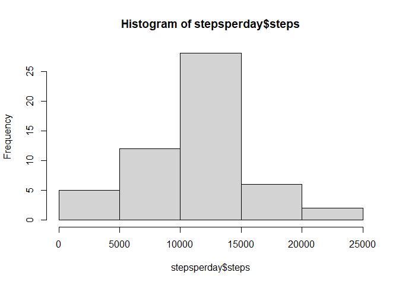
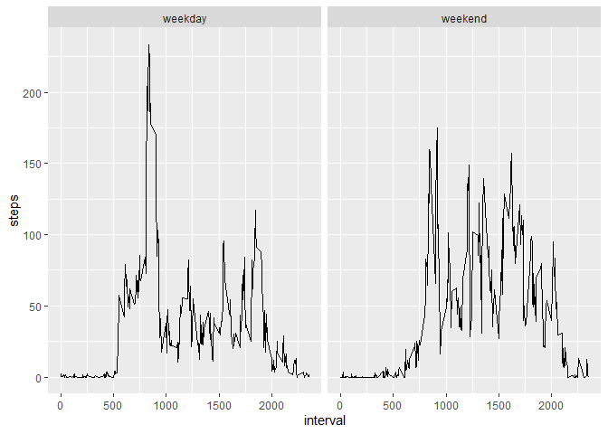

## Loading and preprocessing the data

```r
data <- read.csv(unz("activity.zip", "activity.csv"))
data$date <- as.Date(data$date, format = '%Y-%m-%d')
```


## What is mean total number of steps taken per day?

```r
stepsperday <- aggregate(steps ~ date, data = data, FUN = sum, na.rm = TRUE)
hist(stepsperday$steps)
```

<!-- -->

Average (mean) number of steps taken per day

```r
mean(stepsperday$steps)
```

```
## [1] 10766
```

Median number of steps taken per day

```r
median(stepsperday$steps)
```

```
## [1] 10765
```


## What is the average daily activity pattern?

```r
stepsperinterval <- aggregate(steps ~ interval, data = data, FUN = mean, na.rm = TRUE)
with(stepsperinterval, plot(interval, steps, type = 'l'))
```

<!-- -->

The 5-minute interval with most steps on average

```r
stepsperinterval[which.max(stepsperinterval$steps), ]$interval
```

```
## [1] 835
```


## Imputing missing values
Number of rows with NAs

```r
sum(!complete.cases(data))
```

```
## [1] 2304
```

### Estimation strategy for missing values
For the `(date, interval)`s where `steps` is `NA`, I'm assigning the interval's average number of steps across all the dates.

```r
imputemissing <- function(val, idx) {
    if (is.na(val)) 
        stepsperinterval$steps[idx]
    else
        val
}
impdata <- data.frame(data)
impdata$steps <- mapply(imputemissing, val = impdata$steps, idx = as.numeric(rownames(impdata)))

impstepsperday <- aggregate(steps ~ date, data = impdata, FUN = sum)
hist(stepsperday$steps)
```

<!-- -->

Average (mean) number of steps taken per day

```r
mean(impstepsperday$steps)
```

```
## [1] 10766
```

Median number of steps taken per day

```r
median(impstepsperday$steps)
```

```
## [1] 10766
```

Notice that imputed values do not seem to have much effect on the mean and median of the number of steps taken per day.

## Are there differences in activity patterns between weekdays and weekends?

```r
library(ggplot2)

impdata$daytype <- factor(
    grepl("S(at|un)", weekdays(impdata$date, abbr = TRUE)), 
    levels = c("FALSE", "TRUE"), 
    labels = c("weekday", "weekend"),
)
aggdata <- aggregate(steps ~ interval * daytype, data = impdata, FUN = mean)

qplot(interval, steps, data = aggdata, facets = . ~ daytype, geom = c("line"))
```

<!-- -->
